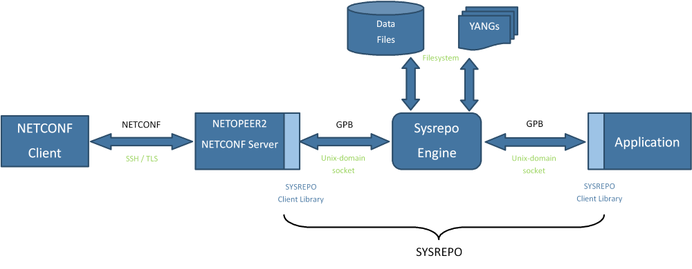

> **Title：**Sysrepo Netconf Note
>
> **Author：**MiaoPei
>
> **Data：**2020-07-15

# Netopper2 安装

- 环境 centos 

## 1. 基础软件安装

```shell
$ sudo yum -y update
$ sudo yum -y upgrade
$ sudo yum -y groupinstall 'Development Tools'
$ sudo yum -y install pcre-devel
$ sudo yum -y install cmake
$ sudo yum -y install doxygen
$ sudo yum -y install valgrind
$ sudo yum -y install zlib-devel
$ sudo yum -y install openssl-devel
$ sudo yum -y install dnssec-trigger
$ sudo yum -y install autoconf libtool
$ sudo yum -y install libev-devel
```

## 2. Netopeer2 Requirements

- [libyang](https://github.com/CESNET/libyang)
- [libnetconf2](https://github.com/CESNET/libnetconf2)
- [sysrepo](https://github.com/sysrepo/sysrepo)

### 2.1 安装 libyang

```shell
$ git clone https://github.com/CESNET/libyang.git
$ cd libyang; mkdir build; cd build
$ cmake ..
$ make
$ make test
# make install
```

**Documentation：**

可以使用 Doxygen 工具直接从源代码生成库文档:

```shell
$ make doc
$ google-chrome ../doc/html/index.html
```

**更改扩展插件目录：**

至于 YANG 扩展，libyang 允许加载扩展插件。默认情况下，存储插件的目录是 LIBDIR/libyang。要更改它，使用下面的 cmake 选项，该选项的值指定所需的目录:

```shell
$ cmake -DPLUGINS_DIR:PATH=`pwd`"/src/extensions/" ..
```

目录路径也可以通过环境变量文件改变运行时，例如:

```shell
$ LIBYANG_EXTENSIONS_PLUGINS_DIR=`pwd`/my/relative/path yanglint
```

**yanglint：**

Libyang 项目包括一个名为 yanglint (1)的功能丰富的工具，用于验证和转换模式和 YANG 模型数据。源代码位于/tools/lint，可用于探索应用程序如何使用 libyang 库。Yanglint (1)二进制文件及其手册页与库本身一起安装。

There is also [README](https://github.com/CESNET/libyang/blob/master/tools/lint/examples/README.md) describing some examples of using `yanglint`.

还有自述文件，描述了使用阳光棉的一些例子。

Libyang 通过插件机制支持 YANG 扩展。一些插件(针对 NACM 或 Metadata)可以开箱即用，并与 libyang 一起安装。但是，如果没有安装 libyang，而是从构建目录中使用 yanglint (1) ，那么这些插件就不可用。有两种选择:

1. 安装 libyang

```shell
# make install
```

1. 设置环境变量 `LIBYANG_EXTENSIONS_PLUGINS_DIR` 包含路径到构建的扩展插件(从构建目录 `./src/extensions` )

```shell
$ LIBYANG_EXTENSIONS_PLUGINS_DIR="`pwd`/src/extensions" ./yanglint
```

### 2.2 安装 libnetconf2

依赖：

- [libyang](https://github.com/CESNET/libyang)
- [libssh](https://git.libssh.org/projects/libssh.git)

```shell
$ git clone http://git.libssh.org/projects/libssh.git
$ cd libssh; mkdir build; cd build
$ cmake ..
$ make
# make install
# or
$ wget https://git.libssh.org/projects/libssh.git/snapshot/libssh-0.7.5.tar.gz
$ tar -xzf libssh-0.7.5.tar.gz
$ mkdir libssh-0.7.5/build && cd libssh-0.7.5/build
$ cmake -DCMAKE_INSTALL_PREFIX:PATH=/usr/local .. && make && sudo make install
$ cd ../..

$ git clone git://git.cryptomilk.org/projects/cmocka.git
$ cd cmocka
$ git checkout tags/cmocka-1.0.1
$ mkdir build; cd build
$ cmake ..
$ make
# make install

$ git clone https://github.com/CESNET/libnetconf2.git
$ mkdir build; cd build
$ cmake ..
$ make
# install
$ make doc 
```

### 2.3 安装 sysrepo

```shell
$ git clone https://github.com/sysrepo/sysrepo.git
$ mkdir build; cd build
$ cmake -DCMAKE_BUILD_TYPE=Debug ..
$ make
# make install
$ make doc
$ google-chrome ../doc/html/index.html
```

## 3. netopper2 安装

```shell
$ git clone https://github.com/CESNET/Netopeer2.git
$ cd Netopeer2
$ export LD_LIBRARY_PATH=/usr/local/lib64:/usr/local/lib
$ mkdir build && cd build
$ cmake ..
$ make
$ sudo make install
```

# libyang 简介

> [libyang doc](https://netopeer.liberouter.org/doc/libyang/master/index.html)

## 1. About

libyang is a library implementing processing of the YANG schemas and data modeled by the YANG language. The library is implemented in C for GNU/Linux and provides C API.

Libyang 是一个用 YANG 语言实现 YANG 模式和数据处理的库。该库是用 c 语言为 GNU/Linux 实现的，并提供了 c API。

## 2. Main Features

- YANG 格式模式的解析(和验证)。
- YIN 格式模式的解析(和验证)。
- 解析、验证和打印 XML 格式的实例数据。
- 解析、验证和打印 JSON 格式的实例数据 (RFC 7951)。
- 操作实例数据。
- 支持实例数据中的默认值 (RFC 6243)。
- 支持 YANG 扩展和用户类型。
- 支持 YANG 元数据 (RFC 7952)。
- yanglint - 特征丰富的 YANG 工具

当前的实现包括 YANG 1.0 (RFC 6020) 和 YANG 1.1 (RFC 7950)。

## 3. Extra (side-effect) Features

- XML 解析器。
- 优化字符串存储 (字典)。

# libnetconf2 简介

## 1. About

libnetconf2 is a NETCONF library in C handling NETCONF authentication and all NETCONF RPC communication both server and client-side. Note that NETCONF datastore implementation is not a part of this library. The library supports both NETCONF 1.0 ([RFC 4741](https://tools.ietf.org/html/rfc4741)) as well as NETCONF 1.1 ([RFC 6241](https://tools.ietf.org/html/rfc6241)).

libnetconf2 是一个 C 语言的 NETCONF 库，处理 NETCONF 认证和所有 NETCONF RPC 通信服务器和客户端。注意，NETCONF 数据存储实现不是这个库的一部分。这个库同时支持 NETCONF 1.0 (RFC 4741) 和 NETCONF 1.1 (RFC 6241)。

## 2. Main Features

- 使用 libssh 创建 SSH (RFC 4742、RFC 6242)，或使用 OpenSSL、经过身份验证的 NETCONF 会话创建 TLS (RFC 7589)。
- 使用预先建立的传输协议创建 NETCONF 会话(例如，使用这种机制可以通过 sshd(8) 进行隧道通信)。
- 创建 NETCONF 呼叫家庭会话(RFC 8071)。
- 创建、发送、接收和回复 RPC (RFC 4741，RFC 6241)。
- 创建、发送和接收 NETCONF 事件通知(RFC 5277)

# sysrepo 简介

## 1. sysrepo 引言

Sysrepo 是一个基于 yang 的 Unix/Linux 系统数据存储。使用 YANG 建模配置的应用程序可以使用 Sysrepo 进行管理。

申请使用 Sysrepo 的方法主要有两种。直接方法包括在需要配置数据时从应用程序本身调用 Sysrepo 函数，或者执行特定的回调以对配置更改做出反应。还可以实现一个独立的守护进程，将 Sysrepo 调用转换为应用程序特定的操作。对于现有的应用程序，这种间接方法通常比较容易使用，因为这样就不需要修改它们自己来利用 Sysrepo 数据存储，而代价是需要一个额外的中间进程(守护进程)。如果有几个这样的守护进程，它们可以作为插件编写，然后由一个进程管理。


Sysrepo 是用于 Unix/Linux 应用程序的基于 yang 的配置和操作状态数据存储。

Sysrepo是一个基于YANG模型的配置和操作数据库，为应用程序提供一致的操作数据的接口，解决了配置读写困难的问题。应用程序使用YANG模型来建模，这样就可以利用YANG模型完成数据合法性的检查，保证的风格的一致，不需要应用程序直接操作配置文件了。

目前，应用程序可以使用 sysrepo Client Library 的 c 语言 API 访问数据存储中的配置，但是对其他编程语言的支持也计划在以后使用(因为 sysrepo 使用 Google 协议缓冲作为数据存储和客户端库之间的接口，为任何支持 GPB 的编程语言编写本地客户端库是可能的)。

Sysrepo 可以很容易地与管理代理(如 NETCONF 或 RESTCONF 服务器)集成，使用应用程序用于访问其配置的相同的客户端库 API。到目前为止，sysrepo 已经与 Netopeer 2 NETCONF 服务器集成。这意味着使用 sysrepo 存储其配置的应用程序可以自动受益于通过 NETCONF 进行控制的能力。



SYSREPO数据库它提供了以下特性:

- 模型配置文件和状态数据的集中存储
- 应用程序可以通过XPATH访问配置
- 支持启动、运行和临时数据存储
- 支持事务，符合ACID
- 根据YANG模型，进行数据一致性和约束的检查
- 没有单一故障点，应用程序不需要运行任何其他进程来访问其配置

sysrepo 实际只是保存配置，并调用回调函数这两件事。

## 2. 命令行工具

有一些二进制文件是严格可选的，因为它们只使用Sysrepo API。但是，它们对于一些常见任务可能很有用，通过包含它们，每个用户不必从头开始编写它们。

### 2.1 sysrepo-plugind

这个应用程序是一个简单的守护进程，它将所有可用的 Sysrepo 插件分组到一个单独的进程中。这个守护进程从插件路径目录加载插件，并支持一些选项， `--verbosity` 和 `--debug`，以避免进入守护进程模式，并保持将所有消息打印到 stderr。

Plugin 是一个共享对象，它必须公开两个函数: `sr_plugin_init_cb()` 和 `sr_plugin_cleanup_cb()`，这两个函数分别在 sysrepo-plugind 的开始和结束时被调用。初始化函数必须执行所有运行时任务，因为守护进程不会调用其他函数。它通常包括创建各种订阅，然后自己处理事件。清理通常会停止这些订阅。

插件路径，这是存储插件的唯一途径。默认路径可以在编译过程中修改(`PLUGINS_PATH` 选项) ，但是如果设置了 `$SRPD_PLUGINS_PATH` 环境变量，则总是会覆盖这个默认路径。

### 2.2 sysrepoctl

它是一个实用工具，可以更改模式(模块)。具体来说，它可以列出、安装、卸载或更新它们。此外，还可以更改模块的特性、重播支持和权限。重要的是要记住哪些操作是立即执行的，哪些操作是延期的(模式中的详细信息)。

**-l，--list**

所有当前安装的模块都列在一个简明的表格中，其中包含有关它们的基本信息。还有关于任何准备好的更改的信息。

```shell
$ sysrepoctl --list
```

**-i，--install \<path\>**

YANG 模块的安装只需要指定它们的路径(YANG 或者 YIN 格式)。

```shell
$ sysrepoctl --install ~/Documents/modules/ietf-interfaces.yang
```

**-u，--uninstall \<module\>**

要删除 YANG 模块，必须指定它的名称(而不是文件名)。所有可以移除的已安装模块都是通过 `--list` 打印的。

```shell
$ sysrepoctl --uninstall ietf-interfaces
```

**-c，--change \<module\>**

已安装的模块可以通过多种方式进行更改，可以选择性地组合成一个命令。

```shell
$ sysrepoctl --change ietf-interfaces --(disable|enable)-feature
```

然后，它们的重播支持(存储接收到的通知)可以被打开或关闭。

```shell
$ sysrepoctl --change ietf-interfaces --replay on
```

最后，可以调整文件系统权限。

```shell
$ sysrepoctl --change ietf-interfaces --owner netconf --group netconf --permissions 660
```

**-U，--update \<path\>**

已安装的 YANG 模块可以更新为更新的版本。

```shell
$ sysrepoctl --update ~/Documents/modules/ietf-netconf@2013-09-29.yang
```

**-C，--connection-count**

获取当前连接的客户端的数量。可用于检查是否可以立即应用某些架构更改(如果没有连接)。

```shell
$ sysrepoctl --connection-count
```

### 2.3 sysrepocfg

这个二进制文件允许以多种方式处理配置，比如导入、导出、编辑和替换(从文件或数据存储中复制)。还可以发送 `rpc/action` 或通知。

所有操作都在 `--datastore` (默认运行、启动或操作)上执行，或者只在特定的 `--module` 上执行，并以支持的 `--format` (默认 xml、 json 或 lyb)处理数据。

**-I， --import[=\<file-path\>]**

为了导入配置，通常会提供一个文件。它的格式将根据扩展自动检测。如果不适用(或者从 STDIN 读取数据) ，可以手动确定。

```shell
$ sysrepocfg --import=~/Documents/data/running.xml
```

还可以导入模块的启动配置。

```shell
$ sysrepocfg --import=~/Documents/data/ietf-interfaces_startup.json --datastore startup --module ietf-interfaces
```

**-X，--export[=\<file-path\>]**

可以将导出的配置打印到文件中，也可以直接打印到 STDOUT。

```shell
$ sysrepocfg --export --datastore operational
```

此外，只能检索配置的特定部分

```shell
$ sysrepocfg --export=ietf-interfaces_running.lyb --format lyb --module ietf-interfaces
```

或者 XPath 选择。

```shell
$ sysrepocfg --export --xpath /ietf-interfaces:interfaces/interface[name='eth0']
```

**-E，--edit[=\<file-path\>/\<editor\>]**

可以在文件中或使用任意文本编辑器提供要合并的数据(作为编辑应用)。另外，在更改运行的数据时，可以锁定数据存储。

```shell
$ sysrepocfg --edit=candidate.xml --datastore candidate
$ sysrepocfg --edit=vim --lock
```

**-R，--rpc[=\<file-path\>/\<editor\>]**

也可以从文件或使用编辑器发送 RPC 或操作。任何输出都打印到 STDOUT。

```shell
$ sysrepocfg --rpc=vim
```

**-N，--notification[=\<file-path\>/\<editor\>]**

以类似的方式执行发送通知。

```shell
$ sysrepocfg --notification=notif.xml
```

**-C，--copy-from \<file-path\>/\<source-datastore\>**

此操作可以用文件或其他数据存储的内容替换模块或数据存储数据。

```shell
$ sysrepocfg --copy-from=ietf-interfaces_startup.xml --module ietf-interfaces --datastore startup
$ sysrepocfg --copy-from=candidate
```

第二个命令实际上是 NETCONF `<commit>` ，因为它将候选数据存储复制到默认运行的数据存储中。

## 3. 插件示例

这部分教你如何编写一个简单的 YANG 模块，然后让 Sysrepo 以插件或独立守护程序的形式处理数据。在继续之前，最好至少对 Sysrepo 有一个基本的了解。

### 3.1 简单的 YANG 模块

对于任何你想用 Sysrepo 管理的设备，你都需要一个设备的 YANG 模块。该语言非常丰富，几乎可以对任何系统进行描述。例如，一个烤箱将完全由 Sysrepo 管理。将介绍 YANG 的所有基本部分，即配置数据、状态数据、 rpc 和通知。

为了简化事情，我们的烤箱是一个便宜的型号，只有一个开关和滑块来设置温度。但是，它可以提供内部实际温度的信息，并且当内部温度达到设定温度时通知厨师。此外，生的食物可以预先准备好，如果有提示，烤箱可以自动将食物放入或取出。这样我们就得到了 YANG 模型:

```shell
module oven {
    namespace "urn:sysrepo:oven";
    prefix ov;
    revision 2018-01-19 {
        description "Initial revision.";
    }
    typedef oven-temperature {
        description "Temperature range that is accepted by the oven.";
        type uint8 {
            range "0..250";
        }
    }
    container oven {
        description "Configuration container of the oven.";
        leaf turned-on {
            description "Main switch determining whether the oven is on or off.";
            type boolean;
            default false;
        }
        leaf temperature {
            description "Slider for configuring the desired temperature.";
            type oven-temperature;
            default 0;
        }
    }
    container oven-state {
        description "State data container of the oven.";
        config false;
        leaf temperature {
            description "Actual temperature inside the oven.";
            type oven-temperature;
        }
        leaf food-inside {
            description "Informs whether the food is inside the oven or not.";
            type boolean;
        }
    }
    rpc insert-food {
        description "Operation to order the oven to put the prepared food inside.";
        input {
            leaf time {
                description "Parameter determining when to perform the operation.";
                type enumeration {
                    enum now {
                        description "Put the food in the oven immediately.";
                    }
                    enum on-oven-ready {
                        description
                            "Put the food in once the temperature inside
                             the oven is at least the configured one. If it
                             is already, the behaviour is similar to 'now'.";
                    }
                }
            }
        }
    }
    rpc remove-food {
        description "Operation to order the oven to take the food out.";
    }
    notification oven-ready {
        description
            "Event of the configured temperature matching the actual
             temperature inside the oven. If the configured temperature
             is lower than the actual one, no notification is generated
             when the oven cools down to the configured temperature.";
    }
}
```

### 3.2 烤箱插件

这里将一步一步地解释如何写一个合适的插件，将管理烤箱。所有代码片段都取自实际的实现。[插件 API](https://netopeer.liberouter.org/doc/sysrepo/master/group__plugin__api.html)

**初始化**

在初始化函数中，通常必须初始化设备并创建对任何相关 YANG 节点的订阅。

```c
food_inside = 0;
insert_food_on_ready = 0;
oven_temperature = 25;
```

首先，肯定要通知烤箱其配置参数的任何变化，这样最容易订阅整个模块。设置标志 [SR_SUBSCR_ENABLED](https://netopeer.liberouter.org/doc/sysrepo/master/group__subs__api.html#ggac91898627ad5aeb589e6a3993a697d14ac5b782dfbbfe74c8ff2b1642a8bb0afe)，以便在 sysrepo-plugind 启动时，独立于烤箱(设备)的状态，将当前存储的配置应用于设备并保持一致性。另一个标志 [SR_SUBSCR_DONE_ONLY](https://netopeer.liberouter.org/doc/sysrepo/master/group__subs__api.html#ggac91898627ad5aeb589e6a3993a697d14a0530a7715e162ee90e298ce504239444) 被使用，因此不会调用回调来验证任何挂起的更改。对于我们的示例，只要基于 YANG 限制的值有效，它就总是正确的。

还可以订阅任意的配置数据子树，但这个示例不需要这样做。

```c
rc = sr_module_change_subscribe(session, "oven", oven_config_change_cb, NULL, 0,
        SR_SUBSCR_ENABLED | SR_SUBSCR_DONE_ONLY, &subscription);
```

然后，由于在 oven 模型中还有状态数据，将执行标记该插件为它们的(独占)提供者的订阅。当 Sysrepo 需要状态数据子树时，通常在客户机请求它们时调用它。

值得注意的是，使用了相同的订阅对象，因此必须指定标志 [SR_SUBSCR_CTX_REUSE](https://netopeer.liberouter.org/doc/sysrepo/master/group__subs__api.html#ggac91898627ad5aeb589e6a3993a697d14a08c075b76b8299ea4b4ed0fbbcb5b9ae)。

```c
rc = sr_dp_get_items_subscribe(session, "/oven:oven-state", oven_state_cb, NULL, SR_SUBSCR_CTX_REUSE, &subscription);
```

最后，该插件还可以处理任何 RPC 调用，这些调用也需要副本。

```c
rc = sr_rpc_subscribe(session, "/oven:insert-food", oven_insert_food_cb, NULL, SR_SUBSCR_CTX_REUSE, &subscription);

rc = sr_rpc_subscribe(session, "/oven:remove-food", oven_remove_food_cb, NULL, SR_SUBSCR_CTX_REUSE, &subscription);
```

Sysrepo 为插件提供了能够以统一方式打印消息的宏，因此建议使用它们。

```c
SRP_LOG_DBGMSG("OVEN: Oven plugin initialized successfully.");
```

一般格式为 `SRP_LOG_(level)(MSG)` 。消息的严重性是由 DBG、 VRB、 WRN 或 ERR 之一编写的，而不是(级别)。在示例中，由于没有指定其他变量参数，因此使用了后缀 MSG。如果有，则省略此后缀。参数与 `printf ()`函数使用的参数相同。

### 3.3 清除

至于清理，所执行的任务差别很大，并且取决于设备。但是，总是需要适当地终止 init 函数中的订阅，这是本示例中所需的惟一工作。

```c
sr_unsubscribe(subscription);
```

为了简化代码，subscription 被定义为一个全局变量，但是也可以使用 private_data，例如，也可以使用应用程序需要的任何附加数据来存储它。之前分配的所有其他回调都可以在需要时使用相同的机制传递附加数据。

### 3.4 配置数据

在示例中，它用 `oven_config_change_cb()` 订阅模块更改。这里看到的代码是实际代码的简化，但是更好地理解回调应该做什么。

```c
static int
oven_config_change_cb(sr_session_ctx_t *session, const char *module_name, sr_notif_event_t event, void *private_ctx)
{
    int rc;
    sr_val_t *val;
    rc = sr_get_item(session, "/oven:oven/temperature", &val);
    if (rc != SR_ERR_OK) {
        goto sr_error;
    }
    //apply the temperature to the device
    sr_free_val(val);
    rc = sr_get_item(session, "/oven:oven/turned-on", &val);
    if (rc != SR_ERR_OK) {
        goto sr_error;
    }
    //apply the switch state to the device
    sr_free_val(val);
    return SR_ERR_OK;
sr_error:
    SRP_LOG_ERR("OVEN: Oven config change callback failed: %s.", sr_strerror(rc));
    return rc;
}
```

首先，可以观察到，事件变量被忽略。在我们的示例中，无论处理哪个事件，我们都执行相同的操作，由于订阅标志，它将不会是除 [SR_EV_DONE](https://netopeer.liberouter.org/doc/sysrepo/master/group__change__subs__api.html#ggaf5289764c79d867bab642997c23b355aa52e97346d4bf27ab64ad9233627ccf39) 之外的任何事件。

然后，读取并应用所有相关的数据节点。这种方法是最简单的方法，不能总是使用，但在这种情况下可以使用，因为可以重新应用更改而不会产生任何效果。更详细的机制(返回更改)是使用 [sr_get_changes_iter()](https://netopeer.liberouter.org/doc/sysrepo/master/group__change__subs__api.html#ga613064e7a7431a30eff2b99b87af5348) 和提供的会话，从而只获得特定的更改值。

### 3.5 状态数据

```c
static int
oven_state_cb(sr_session_ctx_t *session, const char *module_name, const char *path, struct lyd_node **parent, void *private_data)
{
    char str[32];
    sprintf(str, "%u", oven_temperature);
    lyd_new_path(*parent, NULL, "/oven:oven-state/temperature", str, 0, 0);
    lyd_new_path(*parent, NULL, "/oven:oven-state/food-inside", food_inside ? "true" : "false", 0, 0);
    return SR_ERR_OK;
}
```

状态数据回调是自我解释的。由于订阅只针对一个有两片叶子的容器，因此路径只能有一个值。创建相应的子元素。

### 3.6 RPC 订阅

```c
static int
oven_insert_food_cb(const char *path, const sr_val_t *input, const size_t input_cnt, sr_val_t **output, size_t *output_cnt, void *private_data)
{
    if (food_inside) {
        SRP_LOG_ERRMSG("OVEN: Food already in the oven.");
        return SR_ERR_OPERATION_FAILED;
    }
    if (strcmp(input[0].data.enum_val, "on-oven-ready") == 0) {
        if (insert_food_on_ready) {
            SRP_LOG_ERRMSG("OVEN: Food already waiting for the oven to be ready.");
            return SR_ERR_OPERATION_FAILED;
        }
        insert_food_on_ready = 1;
        return SR_ERR_OK;
    }
    insert_food_on_ready = 0;
    food_inside = 1;
    SRP_LOG_DBGMSG("OVEN: Food put into the oven.");
    return SR_ERR_OK;
}
static int
oven_remove_food_cb(const char *path, const sr_val_t *input, const size_t input_cnt, sr_val_t **output, size_t *output_cnt, void *private_ctx)
{
    if (!food_inside) {
        SRP_LOG_ERRMSG("OVEN: Food not in the oven.");
        return SR_ERR_OPERATION_FAILED;
    }
    food_inside = 0;
    SRP_LOG_DBGMSG("OVEN: Food taken out of the oven.");
    return SR_ERR_OK;
}
```

RPC 回调应该执行相应的 RPC。移除食物只能做到这一点。但是插入食物有一些定义的输入参数，所以它们需要被处理。同样，如果存在某些输出参数，则需要创建并返回这些参数，但这不是我们的情况。

### 3.7 Notifications

通知的提供者不需要订阅任何东西，只需在发生通知时生成任何通知即可。

```c
rc = sr_event_notif_send(sess, "/oven:oven-ready", NULL, 0);
```

从这个例子中可以看出，这是相当简单的。此外，如果有通知的任何子节点，则需要创建它们，然后将其传递给函数。

### 3.8 尝试一下

模型和完整的插件源可以在 `sysrepo/examples/plugin` 中找到。生成 Sysrepo 后，烤箱共享库存储在示例中，但不会自动安装。在安装和实际运行插件之前，最好仔细阅读源代码。它只是一个很小的文档化的文件，所以它不应该花费很长时间，而且人们应该了解实现的烤箱功能。此外，上面章节中所涉及的大多数信息只是对所有这些机制的基本和详细描述。

在考虑这个特定的插件之前，必须正确构建和安装 Sysrepo。完成之后，您必须首先安装模型，然后安装插件。为了安装模型，可以使用 sysrepoctl。然后，您必须将共享库放入 liboven。进入插件路径。

之后，您应该准备启动 `sysrepo-plugind`，它将加载插件。如果您启用了调试消息，您应该会看到烤箱插件已成功初始化。

现在您可以自由地使用烤箱配置、rpc和通知了。它应该像YANG模型中描述的那样工作，以及人们期望烤箱如何工作。下面是一个用例：

1. 作为第一步，使用 notif 订阅示例订阅烤箱通知

    ```c
    notif_subscribe_example oven
    ```

2. 准备好待烤箱温度达到一定温度后放入的食物，稍后再进行配置。烤箱默认是关闭的。在NETCONF术语中，执行插入-食物 RPC。您可以使用 sysrepocfg 实现这一点

    ```shell
    $ sysrepocfg --rpc=vim
    ```

    和输入：

    ```xml
    <insert-food xmlns="urn:sysrepo:oven">
        <time>on-oven-ready</time>
    </insert-food>
    ```

    作为 RPC 内容。您应该会看到一些信息 sysrepo-plugind 输出。

3. 现在你要打开烤箱，期待当它达到设定的温度时得到通知。同时，食物应该在那个时候插入。所以,你执行

    ```shell
    $ sysrepocfg --edit=vim --datastore running
    ```

    与内容

    ```xml
    <oven xmlns="urn:sysrepo:oven">
        <turned-on>true</turned-on>
        <temperature>200</temperature>
    </oven>
    ```

4. 在~4秒后，你应该收到通知。您还可以验证是否一切正常

    ```shell
    $ sysrepocfg --export --xpath /oven:*
    ```

    食物应该放在烤箱里。

5. 一旦你认为食物烤得恰到好处，就用另一个RPC移走它

    ```shell
    $ sysrepocfg --rpc=vim
    ```

    和

    ```xml
    <remove-food xmlns="urn:sysrepo:oven"/>
    ```

### 3.9 Oven Daemon

如果您希望您的设备有一个独立的守护进程，它将作为独立的进程运行，而不使用 sysrepo-plugind，那么您不需要开发插件。拥有一个独立的守护进程实际上只有上一句中提到的几个区别。

至于代码本身，不需要特定的函数，因为代码将编译为可执行二进制文件而不是共享库。但是，如果要将插件转换为应用程序，没有什么可以阻止重用整个代码。

所需要的只是一个 `main()` 函数，该函数将在开始处调用 `sr_plugin_init_cb()` 并在终止之前调用`sr_plugin_cleanup_cb()`。 此外，这些功能需要 Sysrepo 会话。 要创建一个，我们首先需要一个连接。 因此，使用 `sr_connect()` 创建连接，如果成功，则使用 `sr_session_start()` 创建会话。 现在，可以通过调用清除函数并释放会话和连接来调用 init 函数并在守护程序终止时正确地进行清理。 此外，在编译此类应用程序之前，必须更改打印宏，因为将不再有处理打印消息的主守护程序。 完成这些更改后，烤箱守护程序应已准备就绪。


# Reference

> [netopeer2 -- GitHub](https://github.com/CESNET/netopeer2)
>
> [sysrepo -- GitHub](https://github.com/sysrepo/sysrepo)
>
> [sysrepo -- 官方入口](https://www.sysrepo.org/)
>
> [sysrepo -- 行云流水gitee](https://gitee.com/yanxiangyu/sysrepo)
>
> [netopeer2 + sysrepo研究总结](https://blog.csdn.net/xuguozheng110/article/details/104043039)

